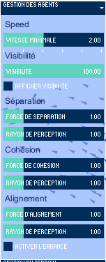
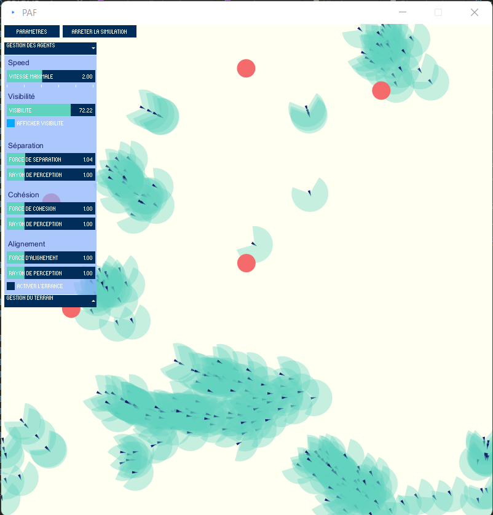
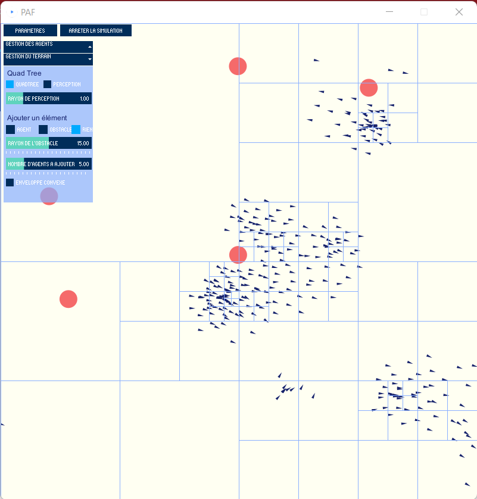
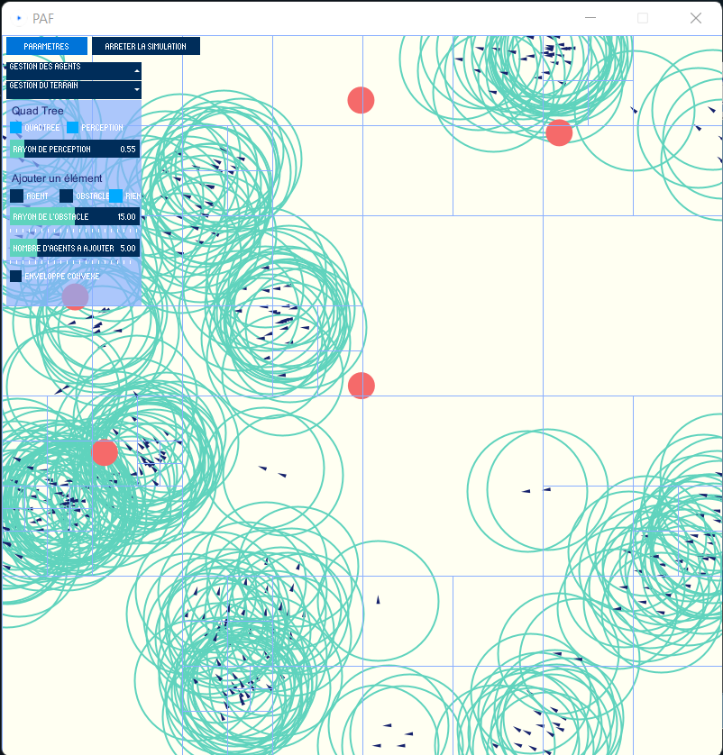

# Manuel d'utilisation


<!-- TABLE DES MATIERES -->
<details>
  <summary>Table des matières</summary>
  <ol>
      <li>
      <a href="#getting-started">Démarrage</a>
      <ul>
        <li><a href="#prerequisites">Prérequis</a></li>
        <li><a href="#installation">Installation</a></li>
      </ul>
    </li>
    <li><a href="#usage">Utilisation</a>
        <ul>
            <li><a href="#agent-handle">Manipulation des agents</a></li>
            <li><a href="#terrain-handle">Manipulation du terrain</a></li>
        </ul>
    </li>
  </ol>
</details>

## Démarrage
<div id="getting-started"></div>

### Prérequis
<div id="prerequisites"></div>

* [Processing](https://processing.org/) : Il faut d'abord installer l'environnement de développement et l'IDE Processing pour pouvoir exécuter les fichier PDE
  
* [ControlP5](https://github.com/sojamo/controlp5)
: Cette librairie permet l'affichage de l'interface graphique du programme. Se référer au repo de la librairie pour l'installer sur Processing

* [Python3](https://www.python.org/downloads/)

<br/>

### Installation
<div id="installation"></div>

1. Cloner le dépôt
```sh
   git clone git@gitlab.enst.fr:PAF/2122/gr16-1.git
   ```

2. Ouvrir le projet avec l'IDE processing ou vscode (Dans ce cas le chemin d'accès à l'IDE Processing doit être renseigné dans les variables d'environnement)


3. S'assurer que les librairies Python `matplotlib, sympy, numpy, csv` sont installées. Exécuter les commandes suivantes dans un invite de commande si ce n'est pas le cas.
```sh
   pip install numpy
   pip install sympy
   pip install csv
   ```


## Utilisation
<div id="usage"></div>

Une fois le programme lancé, l'interface de contrôle permet de modifier la plupart des paramètres du comportement des agents (champ de vision, intensité des forces qui lui sont appliquées...). Elle permet aussi l'affichage de certains paramètres associés à l'environnement dans lequel les agents évoluent.

Les options sont accessibles en cliquant sur le bouton `Paramètres` en haut à gauche.

![Bouton paramètres][param-button]

---
## Manipulation des agents
<div id="agent-handle"></div>

<!-- Interface de gestion des agents -->
<div align="center">
    
</div>
<br/>

### Vitesse maximale

![Réglage de la vitesse maximale][speed-img]

Tous les agents ont la même vitesse maximale. Elle a cinq valeurs possibles, réglables avec le slider `VITESSE MAXIMALE`.

<br/>

### Champ de vision

![Réglage du champ de vision][visibility-img]

Le champ de vision des agents est modifiable avec le slider `VISIBILITÉ`. Il est fixé par défaut à 100% (vision à 360°).

<div align="center">
    
    <br/>
    <em>Champ de vision des agents</em>
</div>

<br/>

### Gestion des forces

![Réglage des forces][forces-img]

Pour chacune des forces appliquées aux agents (`alignement`, `séparation`, `cohésion`), il est possible de modifier son intensité et le rayon de perception des agents. Plus le rayon de perception est élevé, plus il y aura d'agents impliqués dans le calcul de ces forces (Cela a un impact sur le comportement des agents puisque ces forces sont déterminées à partir du comportement de leurs voisins).

<br/>

### Errance

![Réglage de l'errance][wander-img]

Ei elle est activée, l'errance (`wander`) ajoute aux agents un léger mouvement aléatoire. Dans le cas où un agent n'appartiendrait à aucun groupe, sa trajectoire ne serait pas parfaitement rectiligne si l'errance était active. 

---

## Manipulation du terrain
<div id="terrain-handle"></div>

<!-- Interface de gestion du terrain -->
<div align="center">
    
</div>

<br/>

### Arbre quaternaire

![Réglage de l'errance][quadtree-img]

Il est possible d'afficher l'arbre quaternaire dans lequel évoluent les agents, ainsi que le rayon de perception qui permet de connître leur voisinnage.
Le slider `RAYON DE PERCEPTION` permet de modifier la taille du voisinnage de chaque agent. Plus il est faible, plus les performances du programme sont bonnes. En revanche, le calcul des forces de cohésion, de séparation et d'alignement est moins précis. 

<!-- Interface de gestion du terrain -->
<div align="center">
    
    <br/>
    <em>Terrain avec arbre quaternaire</em>
</div>
<br/>
<div align="center">
    
    <br/>
    <em>Terrain avec arbre quaternaire et rayon de perception pour la calcul des voisins</em>
</div>

<br/>

### Ajout d'éléments au terrain

![Ajout d'un élément][add-elmt-img]

Pour ajouter des éléments (obstacles ou agents), il faut sélectionner dans la partie `Ajouter un élément` le type à ajouter, puis faire un clique gauche sur le terrain.

Il n'est possible de placer qu'un obstacle à la fois. Le rayon est réglable avec le slider `RAYON DE L'OBSTACLE`.

Pour créer plusieur agents en même temps, il faut choisir, grâce au slider `NOMBRE D'AGENTS A AJOUTER` le nombre souhaité. 

### Enveloppe convexe


<!-- SOURCES -->
<!-- Boutons principaux -->
[param-button]: readme_images/param.png

<!-- Gestion des agents -->
[speed-img]: readme_images/speed.png
[wander-img]: readme_images/wander.png
[visibility-img]: readme_images/visibility.png
[forces-img]: readme_images/forces.png

<!-- Gestino du terrain -->
[convex-img]: readme_images/convex.png
[add-elmt-img]: readme_images/add-elmt.png
[quadtree-img]: readme_images/quadtree.png


